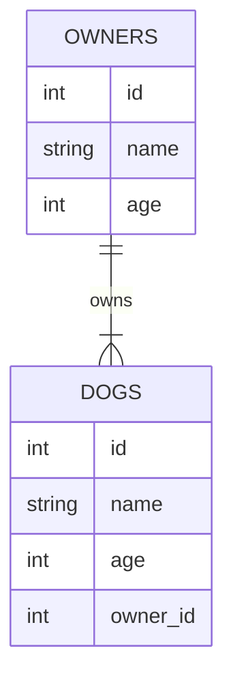

## Mermaid Practice File

I can use mermain on github now, this markdown is practice.

[Mermaid Docs](https://mermaid-js.github.io/mermaid/#/)

### Flowchart LR


```
flowchart LR;
 Lucky[Lucky]
 Alex(Alex)
 Lucky-- Mother Of -->Alex
```

### Erdiagram


